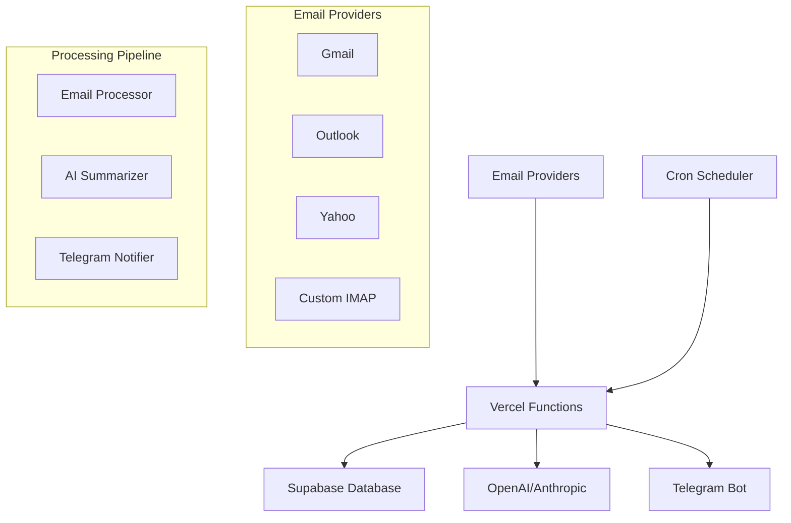

# 📧 Email AI Agent

> **Intelligent email monitoring system that automatically summarizes your emails and sends notifications to Telegram using AI.**


## 🌟 Features

- **🔄 Real-time Email Monitoring**: Automatically checks multiple email accounts every 5 minutes
- **🤖 AI-Powered Summaries**: Uses GPT-3.5/4 or Claude to generate intelligent email summaries
- **📱 Telegram Integration**: Sends instant notifications with email summaries to your Telegram
- **📧 Multi-Provider Support**: Works with Gmail, Outlook, Yahoo, iCloud, and custom IMAP servers
- **🛡️ Secure & Private**: Encrypted password storage and secure API authentication
- **📊 Smart Filtering**: Automatically skips newsletters, automated emails, and spam
- **🎯 Priority Detection**: Identifies urgent emails and high-priority messages
- **💾 Persistent Storage**: Tracks processed emails to avoid duplicates
- **📈 System Monitoring**: Built-in health checks and error tracking
- **⚡ Serverless**: Cost-effective, auto-scaling deployment on Vercel

## 🏗️ Architecture



## 🚀 Quick Start

### Prerequisites

- Python 3.9+
- [Supabase Account](https://supabase.com) (free tier available)
- [Vercel Account](https://vercel.com) (free tier available)
- [OpenAI API Key](https://platform.openai.com) or [Anthropic API Key](https://console.anthropic.com)
- Telegram Bot Token (from [@BotFather](https://t.me/botfather))

### 1. Clone the Repository

```bash
git clone https://github.com/yourusername/email-ai-agent.git
cd email-ai-agent
```

### 2. Set Up Supabase Database

1. **Create a Supabase project** at [supabase.com](https://supabase.com)
2. **Copy the database schema** from `database/schema.sql`
3. **Run the schema** in Supabase SQL Editor
4. **Save your credentials**:
   - Project URL: `https://xxx.supabase.co`
   - Service Role Key: `eyJhbGciOiJIUzI1NiIsInR5cCI6IkpXVCJ9...`

### 3. Configure Environment Variables

Create `.env.local`:

```bash
# Supabase
SUPABASE_URL=https://your-project.supabase.co
SUPABASE_SERVICE_ROLE_KEY=your-service-role-key

# Security
API_SECRET_KEY=your-random-secret-key
ENCRYPTION_KEY=your-base64-encryption-key

# AI Provider
OPENAI_API_KEY=sk-your-openai-api-key

# Telegram
TELEGRAM_BOT_TOKEN=123456789:ABCdefGHI...
TELEGRAM_CHAT_ID=your-chat-id
```

### 4. Deploy to Vercel

```bash
# Install Vercel CLI
npm install -g vercel

# Deploy
vercel

# Set environment variables
vercel env add SUPABASE_URL
vercel env add SUPABASE_SERVICE_ROLE_KEY
# ... add all other variables

# Deploy to production
vercel --prod
```

### 5. Configure Your Email Accounts

Use the configuration API to add your email accounts:

```python
import requests

# Configure Gmail account
requests.post('https://your-app.vercel.app/api/config-manager/email-account', 
    headers={'Authorization': 'Bearer your-secret-key'},
    json={
        'email': 'your-email@gmail.com',
        'provider': 'gmail',
        'username': 'your-email@gmail.com',
        'password': 'your-app-password'  # Use App Password for Gmail
    }
)

# Configure Telegram
requests.post('https://your-app.vercel.app/api/config-manager/telegram-config',
    headers={'Authorization': 'Bearer your-secret-key'},
    json={
        'bot_token': 'your-telegram-bot-token',
        'chat_id': 'your-chat-id'
    }
)

# Configure AI
requests.post('https://your-app.vercel.app/api/config-manager/ai-config',
    headers={'Authorization': 'Bearer your-secret-key'},
    json={
        'provider': 'openai',
        'api_key': 'your-openai-key',
        'model': 'gpt-3.5-turbo'
    }
)
```

## 📖 Usage

### Automatic Processing

The system automatically checks for new emails every 5 minutes via Vercel Cron Jobs.

### Manual Trigger

Trigger email processing manually:

```bash
curl -X POST \
  -H "Authorization: Bearer your-secret-key" \
  -H "Content-Type: application/json" \
  -d '{"trigger_type": "manual"}' \
  https://your-app.vercel.app/api/email-processor
```

### System Status

Check system health:

```bash
curl -H "Authorization: Bearer your-secret-key" \
  https://your-app.vercel.app/api/email-processor
```

## 🔧 Configuration

### Email Providers

#### Gmail Setup
1. Enable 2-Factor Authentication
2. Generate App Password: Google Account → Security → App passwords
3. Use App Password (not your regular password)

#### Outlook Setup
```json
{
  "email": "user@outlook.com",
  "provider": "outlook",
  "username": "user@outlook.com",
  "password": "your-password"
}
```

#### Custom IMAP
```json
{
  "email": "user@company.com",
  "provider": "custom",
  "username": "user@company.com",
  "password": "your-password",
  "imap_host": "mail.company.com",
  "imap_port": 993
}
```

### AI Providers

#### OpenAI (Recommended)
```json
{
  "provider": "openai",
  "api_key": "sk-...",
  "model": "gpt-3.5-turbo",
  "max_tokens": 150,
  "temperature": 0.3
}
```

#### Anthropic Claude
```json
{
  "provider": "anthropic", 
  "api_key": "sk-ant-...",
  "model": "claude-3-haiku-20240307",
  "max_tokens": 150
}
```

### Telegram Setup

1. **Create Bot**: Message [@BotFather](https://t.me/botfather) → `/newbot`
2. **Get Chat ID**: 
   - Message your bot first
   - Visit: `https://api.telegram.org/bot<BOT_TOKEN>/getUpdates`
   - Find your chat ID in the response

## 📊 Monitoring

### Database Tables

- `email_accounts`: Your configured email accounts
- `processed_emails`: Email summaries and metadata  
- `system_logs`: Processing logs and errors
- `telegram_config`: Telegram bot settings
- `ai_config`: AI service configuration

### Health Endpoints

```bash
# System health
GET /api/email-processor

# Recent emails  
GET /api/config-manager/recent-emails

# Email statistics
GET /api/config-manager/accounts
```

### Logs

View logs in Vercel dashboard or via CLI:

```bash
vercel logs https://your-app.vercel.app/api/email-processor
```

## 🛠️ Development

### Local Development

```bash
# Clone repository
git clone https://github.com/yourusername/email-ai-agent.git
cd email-ai-agent

# Install dependencies
pip install -r requirements.txt

# Set up environment
cp .env.example .env.local
# Edit .env.local with your credentials

# Test locally
python api/email-processor.py
```

### Project Structure

```
email-ai-agent/
├── api/                    # Vercel API functions
│   ├── email-processor.py  # Main email processing
│   ├── config-manager.py   # Configuration management
│   └── health-check.py     # System health checks
├── utils/                  # Utility modules
│   ├── database.py         # Supabase integration
│   ├── email_utils.py      # Email processing
│   ├── ai_utils.py         # AI integration
│   └── telegram_utils.py   # Telegram notifications
├── config/                 # Configuration files
├── database/               # Database schema
│   └── schema.sql         # Complete database setup
├── vercel.json            # Vercel configuration
├── requirements.txt       # Python dependencies
└── README.md             # This file
```

### Adding New Features

1. **New Email Provider**: Add settings to `utils/email_utils.py`
2. **New AI Provider**: Extend `utils/ai_utils.py`
3. **Custom Notifications**: Modify `utils/telegram_utils.py`
4. **Additional Endpoints**: Create new files in `api/` directory

## 📈 Cost Estimation

### Monthly Costs (Typical Usage)

| Service | Free Tier | Paid Plan | Usage |
|---------|-----------|-----------|-------|
| **Supabase** | 500MB DB, 2GB bandwidth | $25/month (Pro) | Database + real-time |
| **Vercel** | 100GB bandwidth, 1000 executions | $20/month (Pro) | Serverless functions |
| **OpenAI** | $5 free credit | ~$5-15/month | Email summaries |
| **Telegram** | Free | Free | Notifications |
| **Total** | **Free for testing** | **$50-60/month** | Production use |

### Cost Optimization Tips

- Use GPT-3.5-turbo instead of GPT-4 (10x cheaper)
- Filter out newsletters and automated emails
- Adjust check frequency (5 minutes vs 1 minute)
- Use Supabase free tier for development

## 🔒 Security

### Data Protection
- ✅ **Encrypted Password Storage**: All passwords encrypted using Fernet
- ✅ **API Authentication**: Bearer token authentication
- ✅ **Row Level Security**: Supabase RLS policies enabled
- ✅ **Environment Variables**: Sensitive data in environment only
- ✅ **No Plain Text Storage**: Passwords never stored in plain text

### Best Practices
- Use App Passwords instead of main passwords
- Rotate API keys regularly
- Monitor access logs
- Keep dependencies updated

## 🚨 Troubleshooting

### Common Issues

#### "IMAP Connection Failed"
```bash
# Check email provider settings
# Ensure 2FA and app passwords are set up
# Verify IMAP is enabled in email settings
```

#### "Supabase Connection Error"
```bash
# Verify SUPABASE_URL and SUPABASE_SERVICE_ROLE_KEY
# Check if project is paused/inactive
# Ensure RLS policies allow service role access
```

#### "Telegram Message Failed"
```bash
# Verify bot token format: 123456789:ABC-DEF...
# Ensure you've messaged the bot first
# Check chat ID is correct (can be negative for groups)
```

#### "AI Summarization Failed"
```bash
# Check API key validity
# Verify sufficient credits/quota
# Try different model (gpt-3.5-turbo vs gpt-4)
```

### Debug Mode

Enable debug logging:

```bash
vercel env add DEBUG_MODE true
vercel env add LOG_LEVEL debug
```

## 🤝 Contributing

1. **Fork the repository**
2. **Create feature branch**: `git checkout -b feature/amazing-feature`
3. **Commit changes**: `git commit -m 'Add amazing feature'`
4. **Push to branch**: `git push origin feature/amazing-feature`
5. **Open Pull Request**

### Development Guidelines

- Follow PEP 8 style guide
- Add type hints where possible
- Include error handling
- Write descriptive commit messages
- Test before submitting PR

## 📜 License

This project is licensed under the MIT License - see the [LICENSE](LICENSE) file for details.

## 🙏 Acknowledgments

- [Supabase](https://supabase.com) for the excellent backend platform
- [Vercel](https://vercel.com) for serverless deployment
- [OpenAI](https://openai.com) for AI capabilities
- [Telegram](https://telegram.org) for the messaging platform

## 📞 Support

- **Issues**: [GitHub Issues](https://github.com/anhdan/email-ai-agent/issues)
- **Discussions**: [GitHub Discussions](https://github.com/anhdan/email-ai-agent/discussions)
- **Email**: your-email@example.com

## 🗺️ Roadmap

- [ ] **Web Dashboard**: React-based configuration interface
- [ ] **Multi-User Support**: Support for multiple users per deployment
- [ ] **Advanced Filtering**: Custom email filtering rules
- [ ] **Email Response**: AI-powered email reply suggestions
- [ ] **Calendar Integration**: Extract and create calendar events
- [ ] **Mobile App**: Native mobile applications
- [ ] **Webhook Support**: Real-time email processing via webhooks
- [ ] **Analytics Dashboard**: Email analytics and insights

---

**⭐ If this project helped you, please give it a star on GitHub!**

Made with ❤️ by [AnhDan](https://github.com/anhdan)